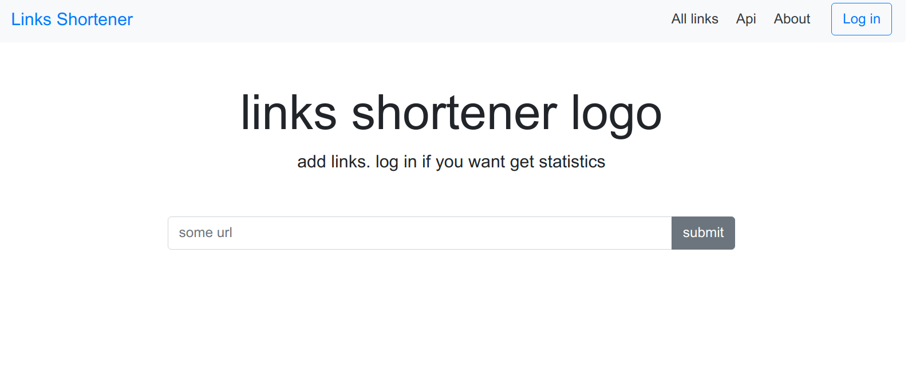

# Cокращатель ссылок

## Используется
- spring
- thymeleaf
- h2
- junit4

## Что умееет
- некоторое api
    - показывать все данные /api/links/
    - показывать только 1 элемент /user/links (в будущем будет показывать только линки для текущего пользователя)
    - добавление данных

- некоторый UI
    - показывает главную со всеми данными в виде таблицы
    - добавление данных

## Как запускать
- или из консоли (mvn spring-boot:run)
- или через ide (Application.java - main)

