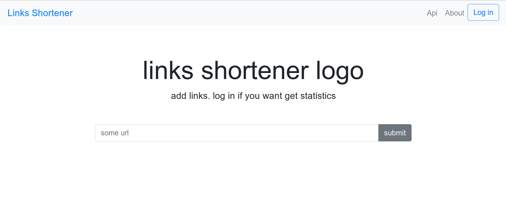

# Cокращатель ссылок

## Используется
- spring (security, jpa, web элементы)
- thymeleaf (layout'ы, базовые элементы, проверка авторизованного пользователя, ...)
- h2
- junit4

## Что умееет
- некоторое api
    - добавлять ссылки для авторизованных (и неавторизованных) пользователей
    - расширенная информация про созданную ссылку, если авторизоваться
    - авторизация через токен (cookie)
    - все ссылки авторизованного пользователя (в процессе)

- некоторый UI
    - для неавторизоаванного пользователя
        - добавление ссылок
    - для зарегистированного, авторизованного пользователя
        - добавление ссылок
        - список его ссылок

## Как запускать
- или из консоли (mvn spring-boot:run)
- или через ide (Application.java - main)

